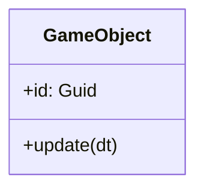
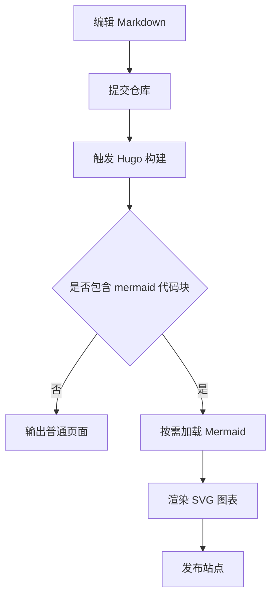
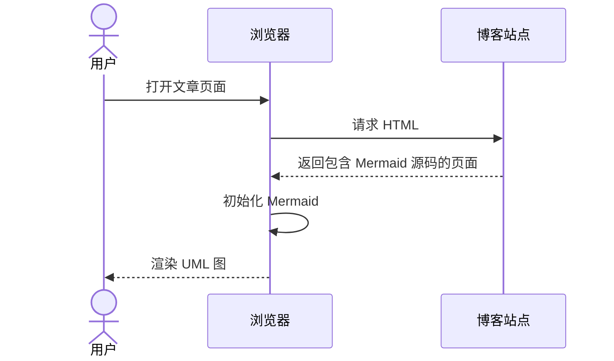
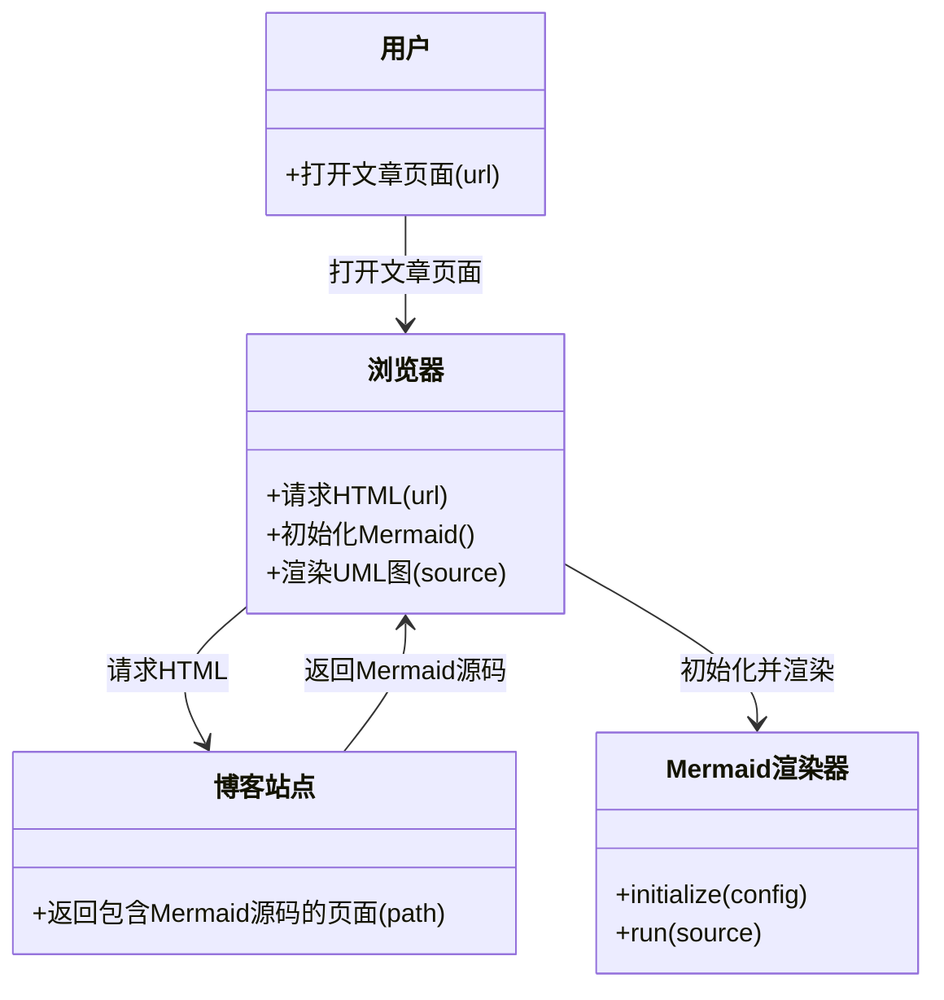
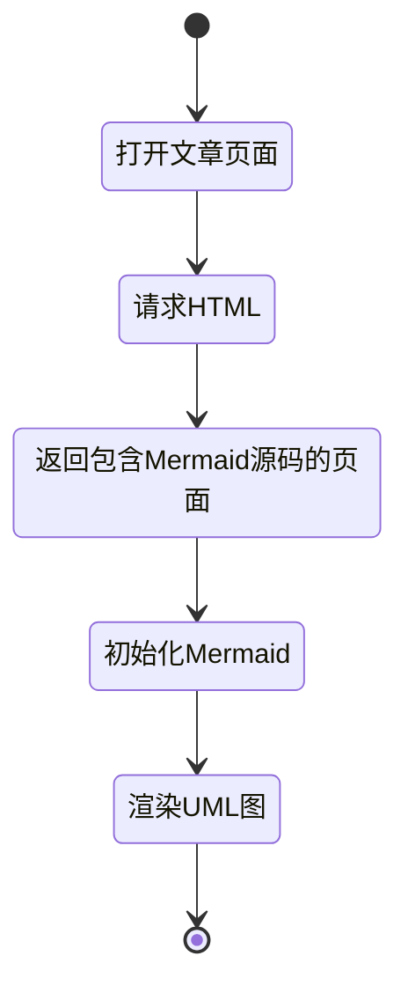
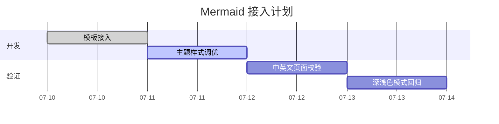
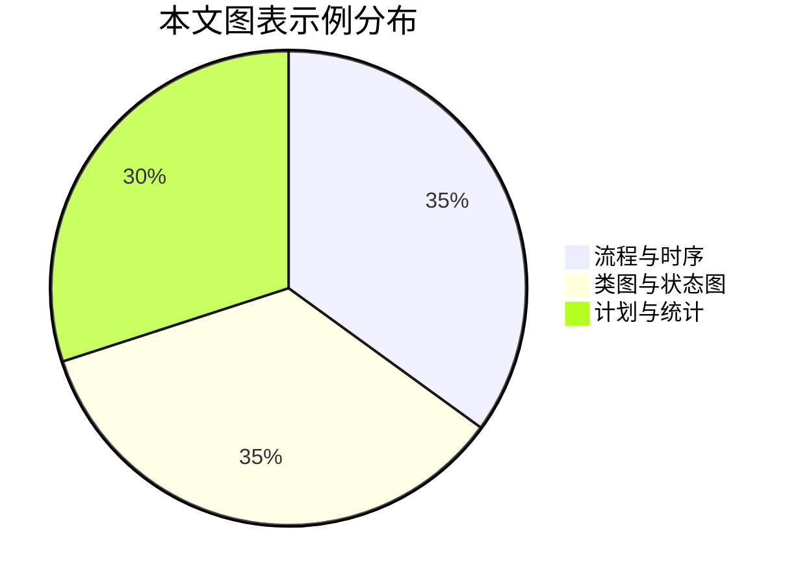

>[!TIP]
> **修改**：本文已根据站点主题重写示例，补充了更完整的 Mermaid 事例，并补齐转载来源。

这篇文章说明如何在本站使用 Mermaid 编写图表，示例主要参考 [菜鸟教程 Mermaid 图表](https://www.runoob.com/markdown/md-draw.html)，并结合本博客主题做了可读性优化。

>[!NOTE]
> Mermaid 采用按需加载。只有包含 Mermaid 代码块的页面才会加载 Mermaid 脚本。

## 快速开始

使用语言标识为 `mermaid` 的代码块：

````markdown

````

## UML 示例（代码与图一一对应）

以下每个案例都采用“代码”+“效果图”成对展示，并选取更典型的业务场景，方便直接复制和对照。

### 1. 流程图（发布流程）

代码：

````markdown

````

效果：


### 2. 时序图（页面请求链路）

代码：

````markdown

````

效果：


### 3. 类图（对象职责）

代码：

````markdown

````

效果：


### 4. 状态图（渲染状态迁移）

代码：

````markdown

````

效果：


### 5. 甘特图（项目排期）

代码：

````markdown

````

效果：


### 6. 饼图（构成占比）

代码：

````markdown

````

效果：


## 写作建议

1. 每张图聚焦一个主题，尽量拆分为多张小图。
2. 技术文章优先使用英文标识符，便于和代码命名保持一致。
3. 标签文本过长时，建议缩短并把细节写在图外正文，避免在小屏上重叠。
4. 图过宽时容器支持横向滚动，无需手动缩放字体。
5. 新增示例时，先在本地 `hugo -D` 验证，再发布。

## 常见问题

>[!TIP]
> 图不显示时，优先打开浏览器控制台查看 Mermaid 语法错误。

1. Mermaid 关键字拼写错误会导致该图渲染失败。
2. 代码块语言必须精确写成 `mermaid`。
3. 同一个 Mermaid 代码块内不要混用 Tab 与空格。
4. 切换主题后图表会自动重渲染，颜色会同步当前模式。
5. 若图表不显示，先检查语法再检查网络（CDN 是否可访问）。

## 兼容性说明

- 当前仅支持 Mermaid 语法。
- 暂未启用 PlantUML 或 Kroki。
- Mermaid 资源会按页面按需加载。
