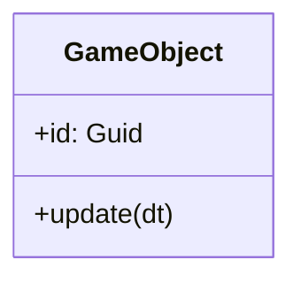
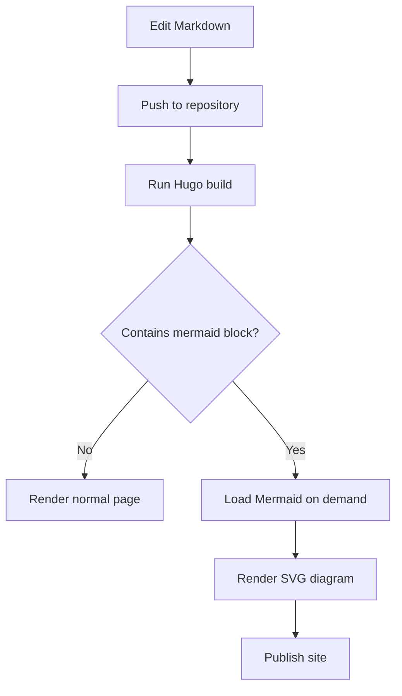
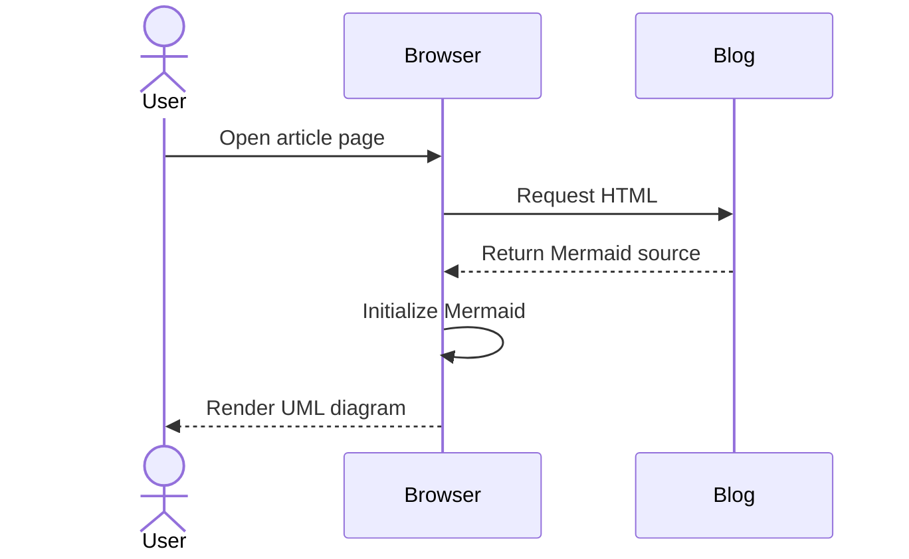
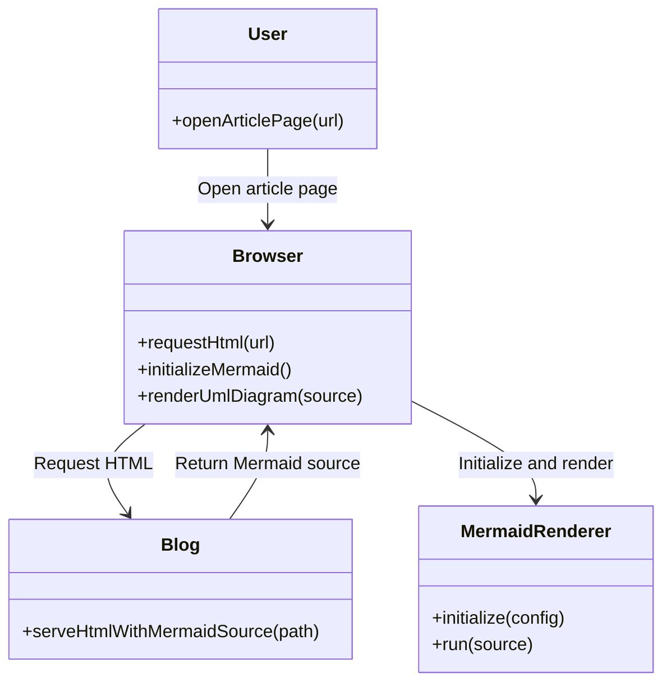
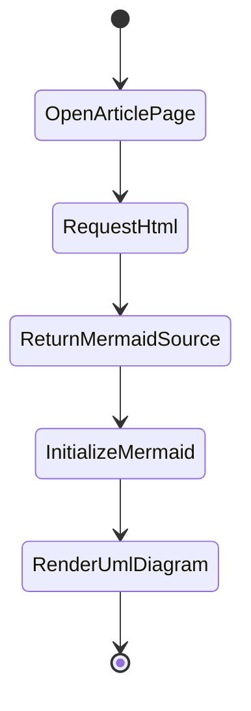
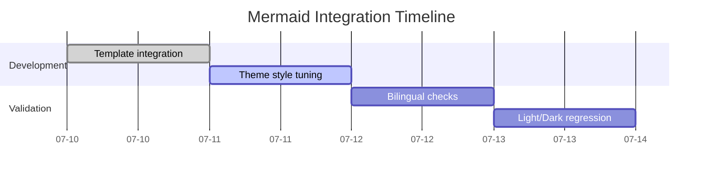
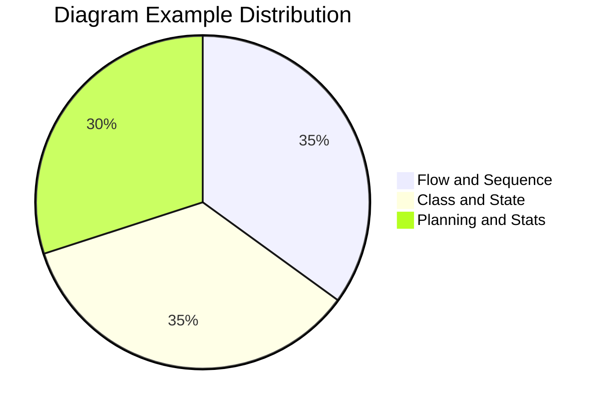

>[!TIP]
> **修改**: This guide has been revised with richer Mermaid examples and a complete repost source link.

This page explains how to write Mermaid diagrams on this site. Example patterns are adapted from [Runoob Mermaid tutorial](https://www.runoob.com/markdown/md-draw.html) and adjusted for this blog theme.

>[!NOTE]
> Mermaid is loaded only on pages that contain Mermaid code fences, so normal pages keep the same loading performance.

## Quick Start

Use a fenced code block with language `mermaid`:

````markdown

````

## UML Examples (Code and Diagram Paired)

Each scenario is shown as a pair: source code first, then the rendered chart below it.

### 1. Flowchart (Publish Pipeline)

Code:

````markdown

````

Diagram:


### 2. Sequence Diagram (Request Lifecycle)

Code:

````markdown

````

Diagram:


### 3. Class Diagram (Responsibility Model)

Code:

````markdown

````

Diagram:


### 4. State Diagram (Render State Transition)

Code:

````markdown

````

Diagram:


### 5. Gantt Chart (Project Schedule)

Code:

````markdown

````

Diagram:


### 6. Pie Chart (Workload Distribution)

Code:

````markdown

````

Diagram:


## Writing Tips

1. Keep each diagram focused on one concern. Use multiple small diagrams instead of one huge diagram.
2. Prefer English identifiers in diagrams for easier maintenance in code-related posts.
3. For long labels, break them into shorter names and describe details in surrounding text.
4. If a diagram is too wide, Mermaid container supports horizontal scrolling automatically.
5. Validate with `hugo -D` before publishing new examples.

## Troubleshooting

>[!TIP]
> If a diagram does not render, check browser console first. Mermaid syntax errors are shown there.

1. A typo in Mermaid keywords can break rendering of that diagram.
2. Make sure the code fence language is exactly `mermaid`.
3. Do not mix tabs and spaces in one Mermaid block.
4. If theme is changed, diagrams are re-rendered automatically to match the current mode.
5. If diagrams fail to render, check syntax first, then check CDN accessibility.

## Compatibility Notes

- Current implementation supports Mermaid syntax only.
- PlantUML or Kroki is not enabled yet.
- Mermaid resources are loaded conditionally per page.
