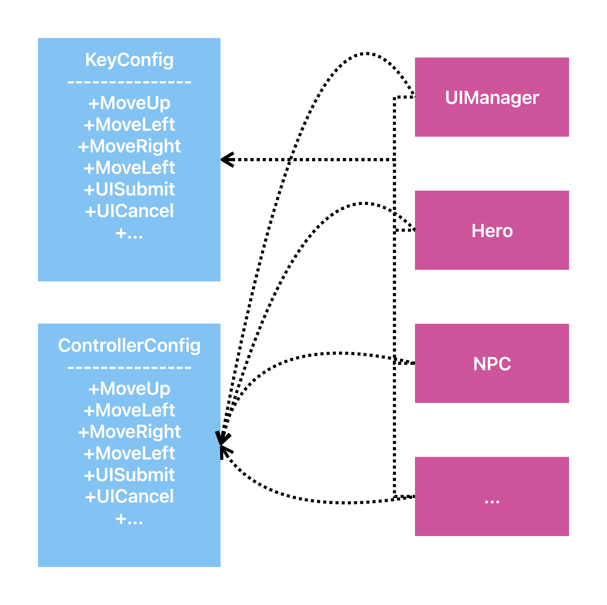

+++
date = '2026-07-06'
draft = false
title = 'Command Pattern'
contentType = 'original'
tags = ["programming-patterns", "c-sharp"]
archives = ["2026-07"]
categories = ["reading-note"]
description = 'Learn how to use or fix problem with command pattern!'
image = "command-pattern.png"
+++

Building a bridge between inputs and actions to decouple them is the core feature of the Command Pattern.

## 1. The real life problem
When creating a player-controlled character, we always face the problem of how to bind user inputs to character actions.

At first glance, this might not even seem like a problem. We can easily handle it using simple `if` statements.

```c#
public class Hero {

    public Hero(Vector2d position) {
        _position = position;
    }

    private Vector2D _position = new(0 , 0);

    //Some properties...

    public void Move() {
        if (Input.GetKeyDown(KeyCode.W))
            _position += Vector2d.Up;
        if (Input.GetKeyDown(KeyCode.A))
            _position += Vector2d.Left;
        if (Input.GetKeyDown(KeyCode.D))
            _position += Vector2d.Right;
        if (Input.GetKeyDown(KeyCode.S))
            _position += Vector2d.Down;
    }

    //Some Methods...
}
```

However, as players, we are often annoyed by bad default keybindings in other games. Therefore, as developers, we must support custom key configurations.

To store these configurations, we might use a `record` in C#.

> While C-like languages use `struct` or `class` for similar purposes, a C# `record` is **immutable** by default. This means it cannot be modified after creation; we must create a new instance if we want to change the keybindings.

```C#
public record KeyConfig (
    KeyCode MoveUp,
    KeyCode MoveLeft,
    KeyCode MoveRight,
    KeyCode MoveDown
);
```

And we can use it to refactor the `Hero.Move()` method.

```C#
public class Hero {
    //Some properties...

    public void Move() {
        if (Input.GetKeyDown(KeyConfig.MoveUp))
            _position += Vector2d.Up;
        if (Input.GetKeyDown(KeyConfig.MoveLeft))
            _position += Vector2d.Left;
        if (Input.GetKeyDown(KeyConfig.MoveRight))
            _position += Vector2d.Right;
        if (Input.GetKeyDown(KeyConfig.MoveDown))
            _position += Vector2d.Down;
    }

    //Some Methods...
}
```

But a completed game involves more than just a few movement keys; it also includes hero skills, UI controls, or support for multiple input devices.



They make the programming structure fragmented and tightly couple inputs and actions.

We actually don't want that to happen, so we introduce the **Command Pattern**.

## 2. The Command Pattern

The core idea of Command pattern is turning a command into an object. When the player presses the button, the `Hero.Move()` doesn't get the message. Instead, it uses a specific class to handle the action based on the input. It wraps the action inside  a `Command` class.

First, we create the base class `Command`:

``` c#
public abstract class Command {
    
    public abstract void Execute(GameActor actor);

}
```

Then, We design the subclass of `Command`:

```c#
public class MoveUpCommand : Command {

    public override void Execute(GameActor actor)) {
        actor.Move(Vector2d.UP);
    }

}

```
> Here, We use the `GameActor` instead of `Hero` , because it can decouple the `Command` and the `Hero`. Furthermore, it even supports multiple players, or enemies controlled by AI.

Here is the fixed version of `Hero`, and the `GameActor`:

```c#
public abstract class GameObject {

    public float Speed { get; protected set; }
    private Vector2d Position {get; set;}

    protected GameObject(float speed, Vector2d position) {
        Speed = speed;
        Position = position;
    }

    //In a real game engine, there will have more features than this simple one.

}


public class Hero : GameObject {
    
    public Hero(float speed, Vector2d position) : base(speed, position)
    {
        Actor = new(this);
    }

    public GameActor Actor { get; private set; }

}

public class GameActor {

    private GameObject _target;

    public GameActor(GameObject target) {
        _target = target;
    }

    public void Move(Vector2d direction) {
        _target.Position += direction.normalized() * _target.Speed;
    }

}

```
> To make programming easier, we define an abstract class `GameObject`, which is the base class of all "**GameObject**" and has some basic game components usually used. 


We create a class `InputHandler`, to handle the input and return the command. It's the **bridge** of the Command Pattern.

```c#
class InputHandler {

    private KeyConfig _config;

    private Command _moveUp;
    private Command _moveLeft;
    private Command _moveRight;
    private Command _moveDown;
    //Some Actions...

    ublic InputHandler(KeyConfig config) { _config = config; }

    public Command HandleInput() {
        if (Input.GetKeyDown(_config.MoveUp))
            return _moveUp;
        if (Input.GetKeyDown(_config.MoveLeft))
            return _moveLeft;
        if (Input.GetKeyDown(_config.MoveRight))
            return _moveRight;
        if (Input.GetKeyDown(_config.MoveDown))
            return _moveDown;
        return null;
    }

}
```
> [!NOTE] There is using `null` to represent **No Operation**.

Finally, we need some code to make `Hero` moving:

```c#
Command command = inputHandler.HandleInput();
command?.Execute(_hero.Actor);
```

>[!CAUTION] Don't forget to check if `Command` is null before using it!

>[!TIP]
> This blog is a **reading note** summarized from [Game Programming Pattern](https://gameprogrammingpatterns.com/command.html). You can get more interesting examples and explanations of the Command Pattern from it!

## 3.Using `Action` as an Alternative
If you are familiar with C#, you might notice that there is a feature that can replace this easily.

It's `Action`!

Instead, we can use `Action`, a C# built-in `Delegate` used to encapsulate a specific behavior that returns no value, to build a *tunnel* between input and actions.

```c#
class InputHandler {

    private Action _heroMoveUp;
    private Action _heroMoveLeft;
    private Action _heroMoveRight;
    private Action _heroMoveDown;
    //Some Actions...

    public void Update() {
        if (Input.GetKeyDown(KeyConfig.MoveUp))
            _heroMoveUp();
        if (Input.GetKeyDown(KeyConfig.MoveLeft))
            _heroMoveLeft();
        if (Input.GetKeyDown(KeyConfig.MoveRight))
            _heroMoveRight();
        if (Input.GetKeyDown(KeyConfig.MoveDown))
            _heroMoveDown();
    }

}
```